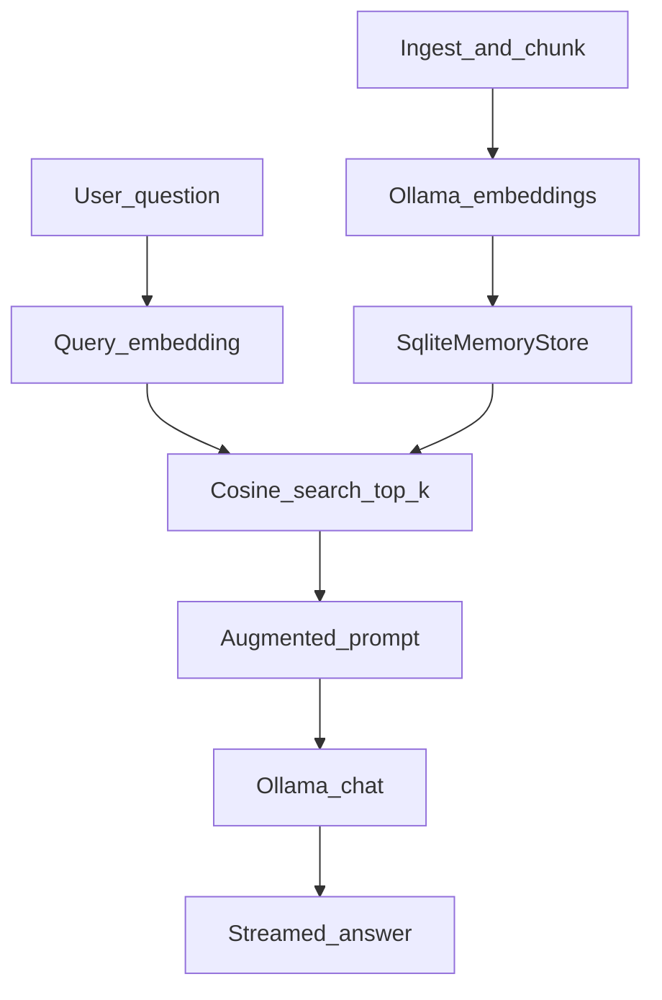

# Local RAG Assistant (Semantic Kernel + Ollama + SQLite)

A **local Retrieval-Augmented Generation (RAG)** console app that answers questions about a personal knowledge base using **Ollama** for embeddings and chat, **Semantic Kernel** for orchestration, and a custom **SQLite vector store** with cosine similarity search.

No cloud API keys required.

## What this demonstrates (ML / NLP)

- RAG pipeline: **chunk → embed → store → retrieve → augment → generate**
- Text chunking for indexing
- Embedding generation with a local model
- Vector similarity retrieval (cosine similarity)
- Context injection and grounded generation
- Custom `IMemoryStore` integration with Semantic Kernel

## Architecture



## Tech stack

| Layer | Technology |
|-------|------------|
| Runtime | .NET 8 |
| Orchestration | Microsoft Semantic Kernel 1.0.1 |
| LLM + embeddings | Ollama (`llama3`, `nomic-embed-text`) |
| Vector store | SQLite (custom `SqliteMemoryStore`) |
| Similarity | Cosine similarity (in-memory over collection) |

## Prerequisites

1. [.NET 8 SDK](https://dotnet.microsoft.com/download)
2. [Ollama](https://ollama.com/) running locally

Pull the models:

```bash
ollama pull llama3
ollama pull nomic-embed-text
```

## Setup and run

From the repository root:

```bash
# 1. Ingest the sample bio corpus
dotnet run --project RAG -- ingest

# 2. Start the chat loop
dotnet run --project RAG -- chat
```

Type `exit` to quit chat mode.

To re-ingest, delete `Ragdata.db` in the project output folder (or working directory) and run ingest again.

## Example questions

Try these after ingest (sample corpus is a short professional bio):

1. Where did Shoaib study for his BSc?
2. What Master's program is he pursuing?
3. What areas of experience does he have?
4. What kind of projects has he worked on?
5. How does he approach personal growth?

During chat, the app prints retrieved chunks with **similarity scores** before generating an answer.

## Design decisions

- **Local-first**: Ollama + SQLite keeps the demo free and portable.
- **Chunking**: Sentence-based chunks (~300 characters) balance recall and context size for a small corpus.
- **Cosine similarity**: Standard metric for normalized embedding vectors; computed in C# over SQLite-stored vectors (fine for small personal corpora).
- **Single augmented user message**: Context and question are combined in one turn to reduce chat-history bloat.
- **History cap**: Last 6 conversation turns are kept to limit prompt growth.

## Project structure

```
RAG/
├── Program.cs              # Ingest + chat CLI
├── AppConfig.cs            # Models, DB path, collection name
├── Data/bio.txt            # Sample knowledge base
└── Connectors/
    ├── SqliteMemoryStore.cs
    ├── OllamaChatCompletion.cs
    └── OllamaTextEmbeddingGeneration.cs
```

## Limitations and future work

- Brute-force cosine search (no ANN index) — suitable for small corpora only
- Plain-text ingest only (no PDF/URL pipeline yet)
- No automated retrieval evaluation (precision@k)
- No REST API or web UI

Possible extensions: hybrid BM25 + vector search, reranking, golden-set eval, FastAPI/ASP.NET API, resume/PDF ingest.

## About

Built by **Gazi Shoaib** — data science / NLP portfolio project demonstrating local RAG with Semantic Kernel.

## License

MIT — see [LICENSE](LICENSE).
